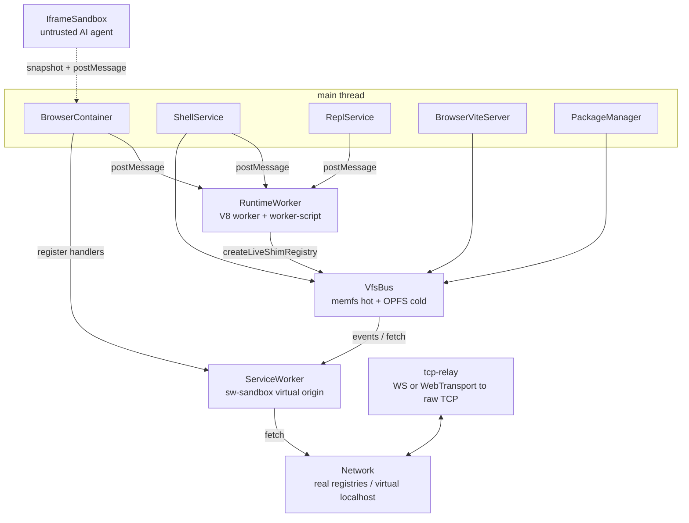
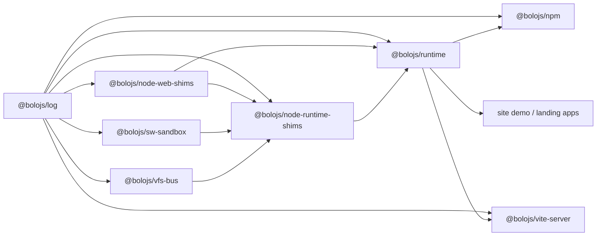

# Architecture

## 1. System overview

bolo runs Node.js entirely inside the browser. The main thread owns the container API, shell, REPL, package installer, and dev server. A dedicated Web Worker runs user code against a live shim registry. The virtual filesystem, ServiceWorker proxy, and an optional self-hosted TCP relay bridge the browser to real registries and network listeners.

Code falls into three compatibility tiers: T1 Web-Standard (no shims), T2 WinterTC/ECMA-429 (node-web-shims), and T3 Node-API (node-runtime-shims). Tier 4 capabilities, including POSIX fork, raw UDP, and inbound TLS termination, are explicitly unsupported.

This document focuses on implementation; `.agents/docs/PRD.md` defines the product tiers and roadmap.

A typical flow: a user runs `node server.ts` in the shell. `ShellService` calls `bundleEntry` from `@bolojs/wasm-registry`, maps `node:*` imports to the container's live shims via `globalThis.__browserContainers`, and executes the resulting bundle as a blob import. If the app calls `http.createServer().listen()`, the `http-shim` registers a fetch handler on `SWSandbox` and emits a `server-ready` event so the preview UI can load the virtual origin.

## 2. Two-tier runtime

**Trusted tier** runs in a `RuntimeWorker` Web Worker using the browser's V8 engine. It executes user scripts via `worker-script.ts`, which sets up a `process` shim, patches `console.log` to emit STDOUT messages, and evaluates code with `(0, eval)`. The REPL uses the same persistent worker context; `REPL_EVAL` buffers input until `isComplete` reports balanced brackets or a valid `Function` parse, giving multi-line continuation. A 5-second heartbeat watchdog terminates the worker if it misses two beats.

**Untrusted tier** is `IframeSandbox`, which implements the `SandboxBackend` seam from `sandbox-backend.ts`. It generates a blob HTML page, creates a `sandbox="allow-scripts"` cross-origin iframe, transfers a `MessageChannel`, and sends a text snapshot of the workdir (excluding `node_modules`). Code is stripped by `transformScript` from `@bolojs/wasm-registry` and executed inside the iframe with `eval`. File writes and deletes from the iframe propagate back to the VfsBus hot layer via `postMessage`. Hard resource caps are delegated to the optional QuickJS community backend; the default sandbox relies on the browser same-origin policy (see ADR-0006).

The iframe runs with an opaque origin, so it cannot access the parent DOM, storage, cookies, IndexedDB, or OPFS.

The `SandboxBackend` interface is intentionally small (`run`, `dispose`) so the trusted tier can switch sandbox implementations. The current default is `IframeSandbox`; an opt-in QuickJS backend remains possible via `@bolojs/quickjs-sandbox`.

Node `child_process.fork()` is emulated by `WorkerChildProcessImpl` in `packages/node-runtime-shims/src/child-process-shim.ts`; a true POSIX `fork` is impossible (ADR-0007).

**Services on the trusted tier**:

| Service | Responsibility |
|---------|----------------|
| `ReplService` | History persisted at `/home/web/.node_repl_history`, multi-line continuation delegated to the worker. |
| `ShellService` | `just-bash` shell against the VFS hot tier, plus builtins for `npm`, `node`, `runtime run`, `agent run`, `curl`, `nc`, and `tcping`. |

## 3. Virtual filesystem

`@bolojs/vfs-bus` provides a single-owner VFS shared through `vfsRegistry`.

| Layer | Storage | Semantics |
|-------|---------|-----------|
| Hot | `memfs` `Volume` | Synchronous, in-memory, primary source for reads and writes. |
| Cold | `OpfsWorker` | Asynchronous, persistent OPFS cache. |

All writes go to the hot layer immediately, then to the cold layer asynchronously, and finally emit `write`/`delete`/`rename` events. Reads check hot first; on a miss the cold layer hydrates the hot file. The `watch(glob, handler)` API matches simple glob patterns and drives `fs.watch` implementations. `use(middleware)` allows ACL-style gates on paths and operations. Hot copies are evicted after five minutes of inactivity. The `fs-shim` forwards `symlink`/`readlink`/`lstat` to the underlying memfs volume so lockfile translators and package managers that rely on symlinks can operate. `snapshot` and `restore` expose the whole memfs volume as JSON for debugging.

## 4. Network stack

### 4.1 ServiceWorker proxy (`sw-sandbox`)

`SWSandbox` registers a ServiceWorker for the virtual origin, opens a `MessageChannel` to it, and lets consumers register handlers with `onFetch`. Inbound requests on `sandbox.local` or `localhost` are routed to the virtual server created by `http.createServer`. Outbound fetches from the page pass through to real registries. The `http-shim` builds `IncomingMessage`/`ServerResponse` streams on top of unenv's `Readable`/`Writable` and implements a `ClientRequest` that uses `fetch` with a pooled `Agent`.

### 4.2 TCP emulation (`node-runtime-shims` net seam)

`net-shim.ts` exposes a `ByteTransport` abstraction with two implementations:

| Transport | Mechanism |
|-----------|-----------|
| `WebSocketTransport` | Binary WebSocket frames with a one-byte type (`0x03`), an 8-byte connection id, and the payload. |
| `WebTransportTransport` | Datagrams for listener control and bidirectional streams for accepted connections. |

Both support `connect` (outbound TCP) and `listen` (inbound TCP). The reference relay is `apps/tcp-relay` (`index.js`): a Node.js WebSocket server that forwards raw TCP with half-close semantics via `close` control messages. If no relay is configured, `NoopTransport` throws with a pointer to the docs. Known gaps: rate limit (#33), backpressure (#34), heartbeat (#36).

### 4.3 DNS, HTTPS, and VM

| Shim | Implementation |
|------|----------------|
| `dns` | DoH via `https://cloudflare-dns.com/dns-query`; full `Resolver` surface including `reverse`/`PTR`. |
| `https` | Delegates to `http-shim.ts`, which uses `fetch` under the hood. |
| `vm` | `quickjs-emscripten-core` with per-context heaps and optional timeout interrupts. |

## 5. Package management and build tools

`@bolojs/npm` implements a browser-native package manager. It uses `@unjs/lockfile` to parse npm, yarn, pnpm, and bun lockfiles, then fetches tarballs directly with `fetch`. Decompression uses the native `DecompressionStream` API and integrity is checked with `crypto.subtle`. Two strategies exist in `PackageManager`: `browser-native` (resolve from registry when no lockfile is present) and `lockfile-only` (use the lockfile's resolved URLs). Both strategies produce a `ResolvedGraph` (from `@unjs/lockfile`'s `resolveGraph()` or the registry-walk path) and hand it to `materializeVirtualStore` (ADR-0008), which lays out a pnpm-style virtual store — `node_modules/.bolo/<name>@<version>/node_modules/<name>` per resolved package, symlinked into place — so multiple versions of the same dependency (diamond deps) coexist correctly instead of collapsing to one. Peer dependencies are linked on a best-effort, graph-wide semver match; `.bin` entries are linked per-package and at the root; optional dependencies that fail to fetch are skipped with a warning rather than failing the install. After install it writes a `package-lock.json` (nested per conflicting version, flat otherwise) and an `importmap.json` with esm.sh fallback URLs. JSR `jsr:` specifiers install through the `npm.jsr.io` mirror. Packument cache lives in `.npm-cache/` with a seven-day TTL. Hardlinks are permanently unsupported because OPFS and the Filesystem Access API have no `link` concept; the VFS handles the virtual store's symlinks by forwarding memfs internals. Cold-layer storage in `@bolojs/vfs-bus` is content-addressed (`CasStore` in `cas.ts`, mirrored inline in `opfs-worker-script.ts`): files are stored once per unique `sha256` hash with per-hash refcounting, so byte-identical files across packages are deduped without needing hardlinks; pre-CAS path-keyed data is migrated lazily on first read.

`@bolojs/wasm-registry` is the WASM tool loader and bundler. It exposes `registerWasmTool` and `resolveWasmTool`, bundles user entries with `rolldown` and `oxc-transform`, and provides `transformScript` (TS strip) used by the iframe sandbox. It also supports WASI tool execution via `createWasiTool` for compilers and formatters that expose a command-line interface.

`@bolojs/vite-server` runs a Vite dev server on the main thread. HMR events are broadcast over `BroadcastChannel` and are triggered by VfsBus `watch` callbacks.

## 6. Package dependency graph

`node-web-shims` is a standalone unenv-backed layer consumed by `node-runtime-shims`. `@bolojs/log` is cross-cutting and provides both a Node entrypoint (`@bolojs/log`) and a browser/worker entrypoint (`@bolojs/log/browser`).

## 7. Observability

`@bolojs/log` wraps `logtape`. Callers obtain a logger with `getLogger(["bolo", <pkg>, <module?>])`. In Node contexts `configureBoloLogging` writes `.logs/<run>.jsonl` and symlinks `.logs/latest.jsonl`, while a pretty console sink defaults to `warning` and above. The `BOLO_LOG` environment variable filters categories and levels. Browser, worker, and ServiceWorker realms use `@bolojs/log/browser` instead of the Node configurator. Guest stdout remains on `console.*` so it is visible in the terminal UI. The full usage guide is in `packages/log/AGENTS.md`.

## 8. ADR index

| ADR | Decision |
|-----|----------|
| [0001](.agents/docs/adr/0001-two-tier-runtime.md) | Adopt a trusted V8 Web Worker tier and a separate untrusted sandbox tier. |
| [0002](.agents/docs/adr/0002-vfs-bus-single-owner.md) | One shared `VfsBus` instance with single write authority, two-layer storage, observable events, and ACL middleware. |
| [0003](.agents/docs/adr/0003-no-webpack-nextjs.md) | Exclude Webpack and Next.js from v1 scope; support Vite and edge-first frameworks. |
| [0004](.agents/docs/adr/0004-package-manager-strategy.md) | Original strategy: npm-in-browser, JSR mirror, and lockfile translation for yarn/pnpm. |
| [0005](.agents/docs/adr/0005-package-manager-strategy.md) | Unified multi-format lockfile compatibility via `@unjs/lockfile`; npm-in-browser removed. |
| [0006](.agents/docs/adr/0006-sandbox-pivot-iframe.md) | Replace the default QuickJS sandbox with a cross-origin iframe; QuickJS becomes an opt-in community package. |
| [0007](.agents/docs/adr/0007-posix-fork-vs-node-fork.md) | POSIX `fork` is unsupported; Node `child_process.fork()` is emulated via Worker + IPC. |
| [0008](.agents/docs/adr/0008-virtual-store-resolver-and-cas.md) | pnpm-style symlinked virtual store for correct multi-version/diamond-dependency installs, plus content-addressed cold storage for cross-package dedup without hardlinks. |
| [0009](.agents/docs/adr/0009-service-locator-considered.md) | Service-locator pattern considered and rejected; `RuntimeBuilder` extraction (B1) is the chosen alternative for composition flexibility. |

## 9. Cross-references

- Product tiers and scope: `.agents/docs/PRD.md`
- Adding or modifying shims: `.agents/docs/contributing-shims.md`
- Public documentation: `docs/` (symlinked into Starlight at `apps/site/docs/src/content/docs`)
